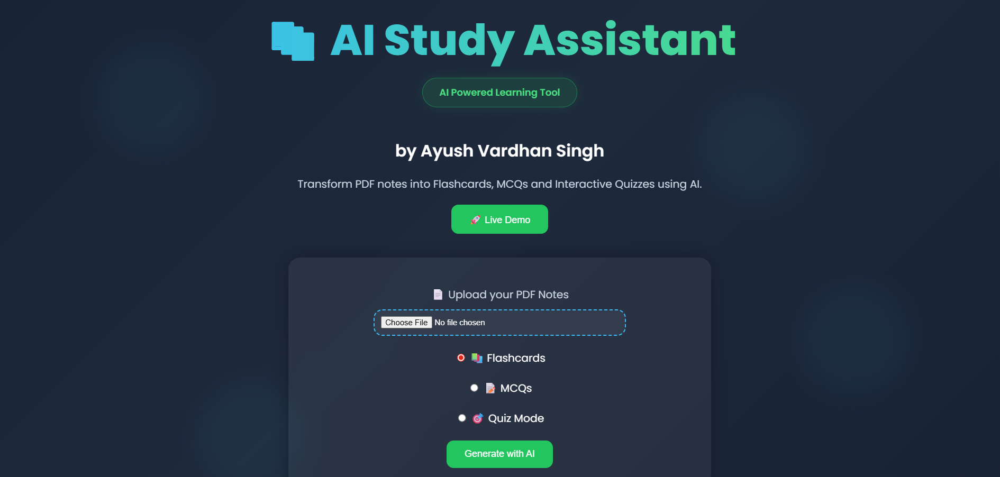
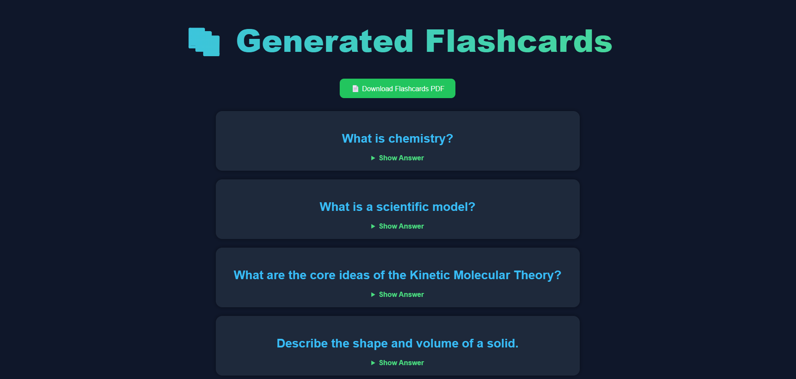
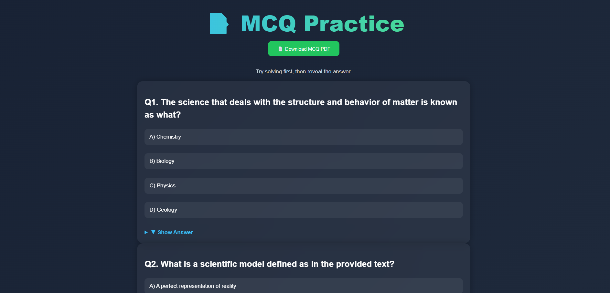
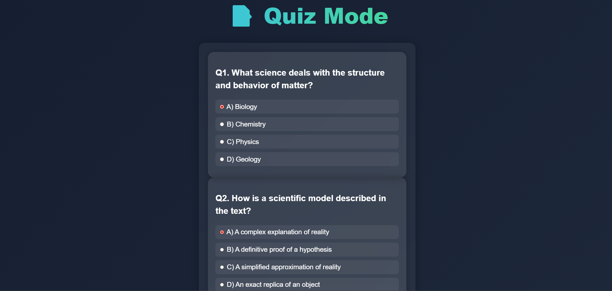

# 📚 AI Study Assistant

An AI-powered learning platform that converts PDF notes into:

- 📚 Flashcards
- 📝 MCQs
- 🎯 Interactive Quizzes
- 📄 Downloadable PDF Reports

Built using Flask, Python and Gemini AI.

---

## 🚀 Features

✅ Upload PDF Notes

✅ Generate Flashcards Instantly

✅ Generate MCQ Practice Sets

✅ Interactive Quiz Mode

✅ Quiz Score Evaluation

✅ PDF Export Support

✅ Beautiful Modern UI

✅ Responsive Design

---

## 🛠️ Tech Stack

- Python
- Flask
- HTML
- CSS
- Gemini AI API
- ReportLab
- PyPDF2

---

## 📸 Screenshots

### Homepage



### Flashcards



### MCQ Practice



### Quiz Mode



---

## ⚙️ Installation

Clone the repository

```bash
git clone https://github.com/AyushVardhanOG/AI-Study-Assistant.git
```

Go inside the project

```bash
cd AI-Study-Assistant
```

Install dependencies

```bash
pip install -r requirements.txt
```

Run application

```bash
python app.py
```

---

## 🌐 Live Demo

https://ai-study-generator.onrender.com

---

## 👨‍💻 Developer

Ayush Vardhan Singh

GitHub:
https://github.com/AyushVardhanOG

LinkedIn:
https://www.linkedin.com/in/ayush-vardhan-singh/

---
